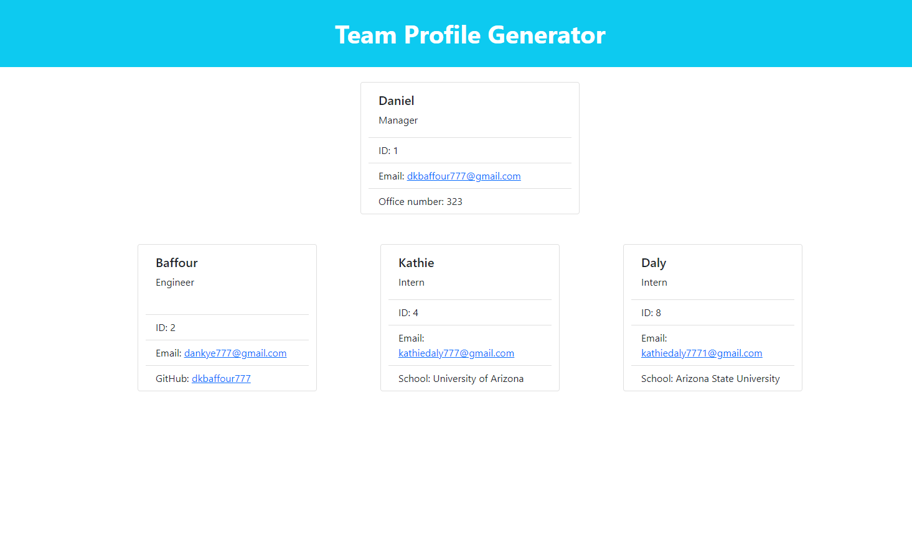
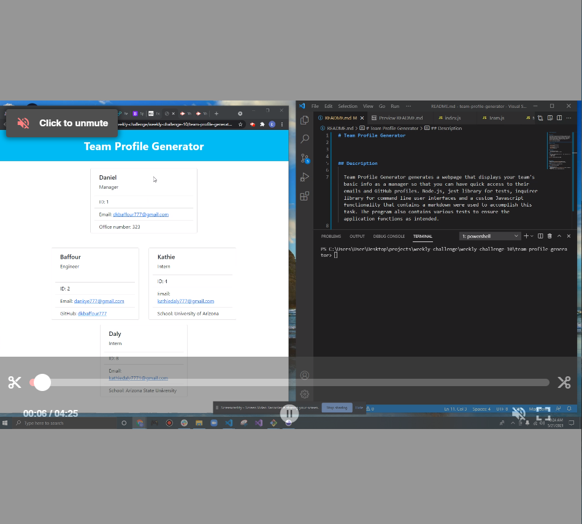
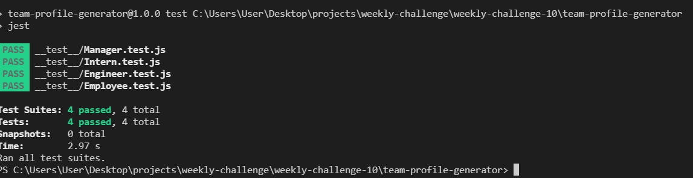

# Team Profile Generator

## Description 

  Team Profile Generator generates a webpage that displays your team's basic info as a manager so that you can have quick access to their emails and GitHub profiles. Node.js, jest library for tests, inquirer library for command line user interfaces and a custom Javascript functionality that contains a markdown were used to accomplish this task. The program also contains various tests to ensure the application functions as intended.

  
  
  
## Table of Contents
  
  
  * [Installation](#installation)
  * [Usage](#usage)
  
  * [Contributing](#contributing)
  * [Tests](#tests)
  * [Questions](#questions)
  

## Installation

  - Clone/Download the project
  - Run 'npm install' in the root directory
  
## Usage 
  
  - For clarity, watch the videos below for a quick tutorial on how to use the application:
    - Video 1: https://drive.google.com/file/d/1WEyZsqXDardYIXaIMpC4Ie1OmWdqBrzD/view
  

  

  
  

## Contributing
  Please read the [Contributor Covenant](https://www.contributor-covenant.org/version/2/0/code_of_conduct/)

## Tests
  - Run 'npm run test' in the root directory
  

## Questions
  - 👋 Hi, I’m dkbaffour777
  - GitHub profile link: [github.com/dkbaffour777/](https://github.com/dkbaffour777/)
  - 📫 How to reach, email: dkbaffour777@gmail.com
